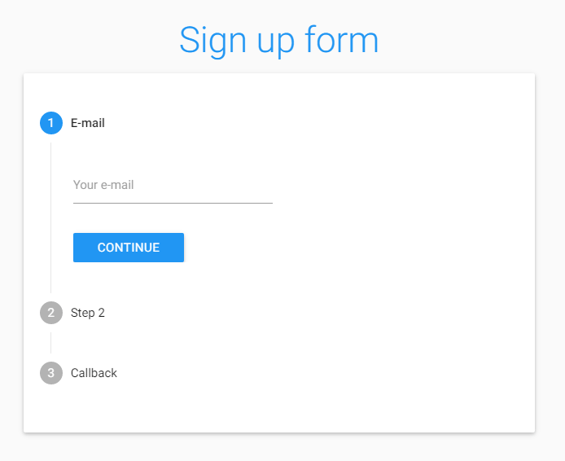

# Materialize-stepper
[](https://badge.fury.io/gh/Kinark%2FMaterialize-stepper)
[](https://badge.fury.io/js/materialize-stepper)

  

A little plugin, inspired by [MDL-Stepper](https://ahlechandre.github.io/mdl-stepper/), that implements a stepper to [Materializecss framework](http://materializecss.com/).

Demo: https://kinark.github.io/Materialize-stepper/  
Codepen Playground: http://codepen.io/Kinark/pen/VKrjJp

## Getting Started

First of all, not native english speaker. Also, I don't know how to work with github yet. Yeah.  

The plugin is simple (really simple), small and has lack of resources, so... Wait for more (???) and... HELP ME!!!

### Prerequisities

Since it's an implementation to [Materializecss framework](http://materializecss.com/), you'll need it. If you want the stepper to verify required inputs, you'll need [jQuery Validation Plugin](https://jqueryvalidation.org/), but it's optional since 2.0.1:

```
- jQuery (obviously)
- Materializecss framework
- Google Material Icons
- jQuery Validation Plugin (optional)
```

### Installing

### Download (zip)

You can [download](https://github.com/Kinark/Materialize-stepper/archive/master.zip) the current version of repository compacted.

### NPM

```bash
npm install --save materialize-stepper
```

You just need to import the .css and the .js files **after** you import the prerequisites listed above:

```html
<!-- Materializecss compiled and minified CSS -->
<link rel="stylesheet" href="https://cdnjs.cloudflare.com/ajax/libs/materialize/0.97.7/css/materialize.min.css">
<!--Import Google Icon Font-->
<link href="http://fonts.googleapis.com/icon?family=Material+Icons" rel="stylesheet">
<!--Import Materialize-Stepper CSS (after importing materialize.css) -->
<link rel="stylesheet" href="materialize-stepper.min.css">

<!-- jQuery -->
<script src="https://ajax.googleapis.com/ajax/libs/jquery/2.2.4/jquery.min.js"></script>
<!-- Materializecss compiled and minified JavaScript -->
<script src="https://cdnjs.cloudflare.com/ajax/libs/materialize/0.97.7/js/materialize.min.js"></script>
<!-- jQueryValidation Plugin -->
<script src="https://ajax.aspnetcdn.com/ajax/jquery.validate/1.15.0/jquery.validate.min.js"></script>
<!--Import Materialize-Stepper JavaScript (after the jquery.validate.js and materialize.js) -->
<script src="materialize-stepper.min.js"></script>

```

## Usage

It does have an horizontal version already (you can check it in the first topic of usage section). The HTML base (a three steps example) is like this:

```html
<ul class="stepper linear">
   <li class="step active">
      <div class="step-title waves-effect">E-mail</div>
      <div class="step-content">
         <div class="row">
            <div class="input-field col s12">
               <input id="email" name="email" type="email" class="validate" required>
               <label for="first_name">Your e-mail</label>
            </div>
         </div>
         <div class="step-actions">
            <button class="waves-effect waves-dark btn next-step">CONTINUE</button>
         </div>
      </div>
   </li>
   <li class="step">
      <div class="step-title waves-effect">Passo 2</div>
      <div class="step-content">
         <div class="row">
            <div class="input-field col s12">
               <input id="password" name="password" type="password" class="validate" required>
               <label for="password">Your password</label>
            </div>
         </div>
         <div class="step-actions">
            <button class="waves-effect waves-dark btn next-step">CONTINUE</button>
            <button class="waves-effect waves-dark btn-flat previous-step">BACK</button>
         </div>
      </div>
   </li>
   <li class="step">
      <div class="step-title waves-effect">Fim!</div>
      <div class="step-content">
         Finish!
         <div class="step-actions">
            <button class="waves-effect waves-dark btn" type="submit">SUBMIT</button>
         </div>
      </div>
   </li>
</ul>
```

After that you'll need to initialize it through:

```html
<script>
$(function(){
   $('.stepper').activateStepper();
});
</script>
```

## Explanation

Every class explains very well it's function, so... Everything runs inside a ul with ".stepper" class:

```html
<ul class="stepper linear">
```

Each step runs inside a li tag with the class ".step": 

```html
<li class="step">
```

Inside each step there is two divs. The ".step-title", where you put the title of... guess what...

```html
<div class="step-title waves-effect waves-dark">First step</div>
```

And the ".step-content", that holds the information:

```html
<div class="step-content"></div>
```

There's the ".step-actions" container inside step-content, which holds the buttons:

```html
<div class="step-actions"></div>
```

And finally there's the buttons, which proceed (.next-step) or return (.previous-step):

```html
<button class="waves-effect waves-dark btn next-step">CONTINUE</button>
<button class="waves-effect waves-dark btn-flat previous-step">BACK</button>
```

## Options

### JS initialization setting(s)
If you are using linear stepper, clicking on the next and the previous step will work just like the buttons. 
Since 2.1 you can adjust some options. Here they are, with their respective defaults:

```html
<script>
$(function(){
   $('.stepper').activateStepper({
      linearStepsNavigation: true, //allow navigation by clicking on the next and previous steps on linear steppers
      autoFocusInput: true, //since 2.1.1, stepper can auto focus on first input of each step
      autoFormCreation: true, //control the auto generation of a form around the stepper (in case you want to disable it)
      showFeedbackLoader: true //set if a loading screen will appear while feedbacks functions are running
   });
});
</script>
```

### Horizontal and non-horizontal

You can make your stepper horizontal just adding a ".horizontal" class to your primary "ul" tag. Since version 2.1 horizontal steppers are responsive and turns to vertical from **992px** (width) down:
```html
<ul class="stepper horizontal">...</ul>
```

For now, horizontal stepper contents doesn't have an automatic height. You can change the default size (458px) of your primary "ul" class with CSS:
```html
ul.stepper.horizontal {
   min-height: 458px;
}
```
or inline:
```html
<ul class="stepper horizontal" style="min-height:458px">...</ul>
```

**IMPORTANT: THE HEIGHT OF THE ".stepper-content" TAG IS SUBTRACTED BY 84PX. SO, FOR EXAMPLE, IF YOU WANT YOUR CONTENT TO HAVE 400PX HEIGHT, YOU'LL NEED TO SET THE "min-height" OF YOUR PRIMARY "ul" TAG TO 484PX!**

### Linear and non-linear

If you want users to change between steps freely (without validations or the obligation to advance a step at a time), just remove .linear class from the primary ul:

```html
<ul class="stepper">...</ul>
```

### Form and inputs

If there is no "form" tag wrapping the ul, JS spawns it for the validate.js to work with the inputs (can be disabled). Since the primary funcion of stepper is to split some kind of form, for now, the only way to make a step required is to add "required" attribute to an input inside the .step-content container:

```html
<input id="email" name="email" type="email" class="validate" required />
```

If the input is not valid, the icon will turn red until all required inputs become valid.

If you want to define your own attributes, just wrap the "ul" with a default "form", using any attributes you need:

```html
<form action="youraction" method="yourmethod">
   <ul class="stepper linear">...</ul>
</form>
```

If you want to submit your stepper, just create a submit button with "submit" type and no feedback or "next/previous-step" class:

```html
<button class="waves-effect waves-dark btn" type="submit">SUBMIT</button>
```

Ooooor, if you want to do it programatically, just call "submitStepper()" function:

```html
$('.stepper').submitStepper();
```

### Step labels

You can add you own step labels by adding a "data-step-label" to your "step-titles" tags. Just like that:
```html
<div data-step-label="OMG, they're so small and cute!" class="step-title waves-effect">Step title</div>
```

### Navigate

There is three ways to navigate through steps.

1. By clicking on them, if you are not using the ".linear" class. If you are, clicking on the next and the previous step will work just like the buttons (what you can disable with the JS initialization setting(s) listed above).

2. By the buttons inside the steps:

```html
<!-- If you want the button to proceed, give it a .next-step class -->
<button class="waves-effect waves-dark btn next-step">CONTINUE</button>
<!-- If you want the button to return, give it a .previous-step class -->
<button class="waves-effect waves-dark btn-flat previous-step">BACK</button>
<!-- If you want the button to submit the form, give it no additional classes and define type="submit" -->
<button class="waves-effect waves-dark btn" type="submit">SUBMIT</button>
```

3. By navigating programatically and, for that, there is three jQuery functions:

To proceed one step:
```html
$('.stepper').nextStep(callback);
```

To return one step:
```html
$('.stepper').prevStep(callback);
```

And to jump to a specific step:
```html
//Just pass the number (int) of the wanted step as a parameter
$('.stepper').openStep(2, callback);
```


### Callback/feedback

There's a way to make the buttons run a function instead of proceeding, just add a data-feedback attribute with the function name to a ".next-step" classified button. Just like that:

```html
<button class="waves-effect waves-dark btn next-step" data-feedback="checkEmailDB">CONTINUE</button>
```

When the user press the button, a loading screen will overlay everything (can be disabled), making the user unable to proceed until you trigger the nextStep function manually. It's useful when you need to check if an e-mail exists in database through AJAX, for example.

To dimiss the feedback loading screen and proceed, you just need, as I said, to trigger nextStep function:

```html
$('.stepper').nextStep(callback);
```

Or trigger "openStep()" funtion, which will dimiss it too:

```html
$('.stepper').openStep(/*some step*/);
```

If you want to dimss it but doesn't proceed, you just call:

```html
$('.stepper').destroyFeedback();
```

And if for some reason you want to activate the feedback screen on the active step, just call:

```html
$('.stepper').activateFeedback();
```

It's also useful if you don't want to submit the form in the end.

If you want to trigger an error with a message in one of the steps, just use this function:

```html
$('selector').showError('error message');
```

That is a shorthand with additions to showErrors function of jQueryValidation plugin.

### Custom Events

Materialize Stepper has custom events for you to bind actions to stepper events.

Here they are:  
* When there was a step changing: '**stepchange**'
* When the next step was triggered: '**nextstep**'
* When the prev step was triggered: '**prevstep**'
* When some step was activated (like, step 3): '**step3**' -- (just change the number)

Just use them like this:
```html
$('.stepper').on('putherethecustomevent', function(){
   /*Something happening!*/
});
```

You can also add your custom custom events. For that to happen, you just need to add a "data-event" to any step:
```html
<li data-event="yourcustomcustomevent" class="step active">...</li>
```

### Dynamically adding steps

If you want to activate steps dinamically, you just need to add a step without the class .step and with display:none css property:

```html
<li class="activate-after" style="display:none;">...</li>
<li class="activate-after" style="display:none;">...</li>
```

And to activate it, you just need to run activateStep() function on the elements you want to add:

```html
$('.activate-after').activateStep(callback);
```

To deactivate them, guess what?

```html
$('.activate-after').deactivateStep(callback);
```

Ps.: unfortunately there is a bug with the animation if you add dinamically a last step on the horizontal stepper. I'm working to fix it :)

## Extra

To end it, there is some extra features for you to use:

### Reset stepper

If you want to reset your stepper (all inputs and thing), you can call "resetStepper" function:
```html
// In the step parameter, you can pass a step (int) for the stepper to open after the reset. Otherwise it'll open the first one.
$('.stepper').resetStepper(step);
```

### Get active step number

If you need to get the active step number for some reason, you can use "getActiveStep()" function, that will return a int with the index of the step:
```html
// The function sums 1 to the index, so it starts on one instead of zero.
if($('.stepper').getActiveStep() == 4) {/*do something...*/};
```

### Change step-number background color:
Just use this long line of CSS with your own color:
```html
ul.stepper:not(.horizontal) .step.active::before, ul.stepper:not(.horizontal) .step.done::before, ul.stepper.horizontal .step.active .step-title::before, ul.stepper.horizontal .step.done .step-title::before {
   background-color: #2196f3 !important;
}
```

## Limitations

None, I think :)

## Final observations

* Every command works like an accordion collapsible. If you trigger "openStep(step)" or "nextStep()", it'll close the active step, remove any feedback screen and execute their functions.

* "prevStep()" won't close the feedback loading screen.

## Changelog

Just visit [CHANGELOG](CHANGELOG.md) file.

## Built With

* Atom - ergaerga

## Authors

* **Igor Marcossi** - *Initial work* - [Kinark](https://github.com/Kinark)

## License

This project is licensed under the MIT License - see the [LICENSE](LICENSE) file for details.

## Acknowledgments

* THANK YOU [Materializecss framework](http://materializecss.com/) FOR EVERYTHING!
* THANK YOU [MDL-Stepper](https://ahlechandre.github.io/mdl-stepper/) FOR IDEAS AND A LITTLE OF CSS!
